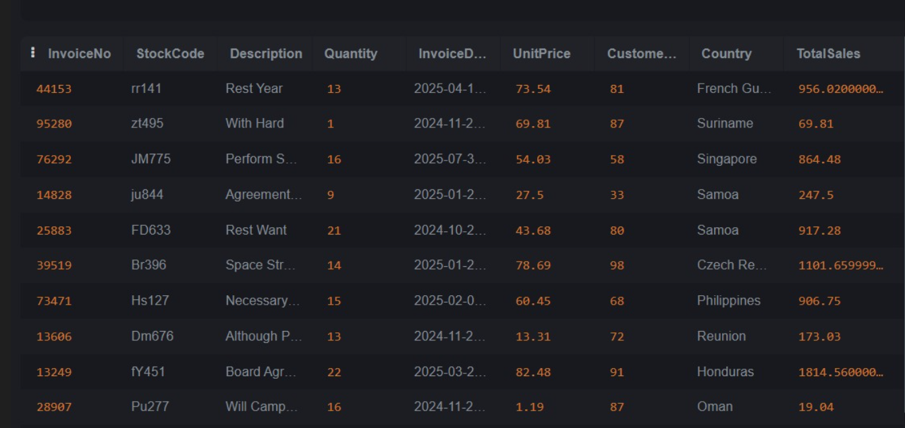
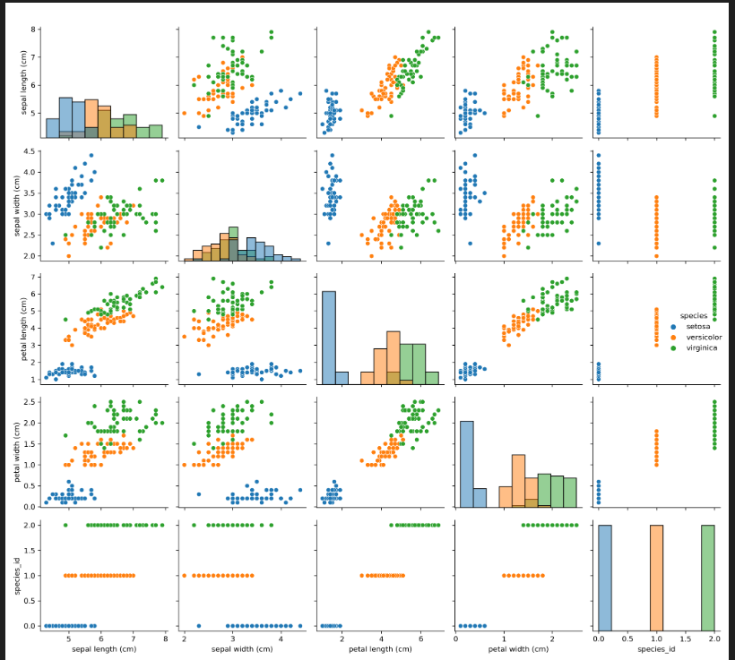
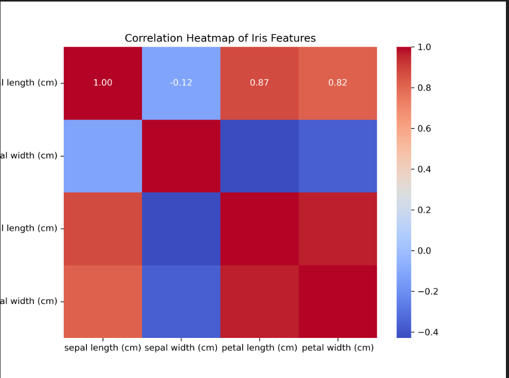

# DSA 2040 Practical Exam Submission

**Name:** \[Merhawit Tesfay Kassa]
**Student ID:** \[670554]
**Exam:** DSA 2040 US 2025 – Data Warehousing and Data Mining
**Repository:** `DSA_2040_Practical_Exam_[Merhawit][554]`
**Date:** August 14, 2025


## Table of Contents

1. [Overview](#overview)
2. [Directory Structure](#directory-structure)
3. [Datasets](#datasets)
4. [Task 1: Data Warehousing](#task-1-data-warehousing)

   * [1.1 Schema Design](#11-schema-design)
   * [1.2 ETL Process](#12-etl-process)
   * [1.3 OLAP Queries & Analysis](#13-olap-queries--analysis)
5. [Task 2: Data Mining](#task-2-data-mining)

   * [2.1 Data Preprocessing](#21-data-preprocessing)
   * [2.2 Clustering](#22-clustering)
   * [2.3 Classification & Association Rules](#23-classification--association-rules)
6. [How to Run](#how-to-run)
7. [Self-Assessment](#self-assessment)

---

## Overview

This repository contains the **practical exam submission** for **DSA 2040 – Data Warehousing and Data Mining**.

* **Section 1 (Data Warehousing):** Designed a star schema, implemented ETL to load a retail dataset into SQLite, executed OLAP queries, and visualized results.
* **Section 2 (Data Mining):** Preprocessed the Iris dataset, applied clustering, classification, and association rule mining for pattern discovery.

---

## Directory Structure

```
DSA_2040_Practical_Exam_[YourName][ID]/
│
├── README.md
├── datasets/
│   ├── online_retail.csv
│   ├── synthetic_retail.csv
│   └── synthetic_transactions.csv
│
├── dw_sql/
│   ├── create_tables.sql
│   └── olap_queries.sql
│
├── notebooks/
│   ├── Iris_Preprocessing_and_Exploration.ipynb
│   ├── classification_iris.ipynb
│   ├── clustering_iris.ipynb
│   ├── mining_iris_basket.ipynb
│   └── etl_retail.ipynb
│
├── outputs/
│   ├── schema_diagram.png
│   ├── sales_by_country.png
│   ├── pairplot_iris.png
│   ├── heatmap_iris.png
│   ├── cluster_scatter.png
│   ├── decision_tree.png
│   └── confusion_matrix.png
│
└── retail_dw.db
```

---

## Datasets

1. **Online Retail dataset (UCI)** – real-world transactional data.
2. **Synthetic Retail dataset** – generated dataset (\~1000 rows).
3. **Synthetic transactional dataset** – market-basket style data (50 transactions).
4. **Iris dataset** – classical ML dataset for classification and clustering.

---

## Task 1: Data Warehousing

### 1.1 Schema Design

A **star schema** was created consisting of:

* **Fact Table:** `SalesFact` (SaleID, CustomerID, ProductID, TimeID, Quantity, TotalSales)
* **Dimensions:** `CustomerDim`, `ProductDim`, `TimeDim`

**Schema Diagram (placeholder):**
xt](image-1.png)

### 1.2 ETL Process

* Extracted data from **synthetic retail dataset**.
* Transformed attributes: handled missing values, calculated `TotalSales`.
* Loaded data into **SQLite warehouse** (`retail_dw.db`).

**Sample ETL Output (placeholder):**

| SaleID | CustomerID | ProductID | TimeID | Quantity | TotalSales |
| ------ | ---------- | --------- | ------ | -------- | ---------- |
| 1      | 101        | 201       | 301    | 5        | 250.0      |
| 2      | 102        | 202       | 302    | 2        | 80.0       |
| 3      | 103        | 203       | 303    | 1        | 45.0       |

---

### 1.3 OLAP Queries & Analysis

Example query: **Total sales by country**.

**Sample Output (placeholder):**

| Country | TotalSales |
| ------- | ---------- |
| USA     | 1500.0     |
| UK      | 1200.0     |
| Germany | 900.0      |

**Visualization (placeholder):**



**Analysis:**

* USA recorded the highest total sales.
* Star schema enables efficient **roll-up (yearly totals)** and **drill-down (by customer)**.

---

## Task 2: Data Mining

### 2.1 Data Preprocessing

* Normalized Iris dataset using **MinMax scaling**.
* Handled categorical labels by encoding species.
* Conducted exploratory analysis via **pairplot** and **correlation heatmap**.

**Visualizations (placeholders):**

* Pairplot: !

* Heatmap: !

---

### 2.2 Clustering

* Applied **K-Means clustering** (k=3).
* Elbow method confirmed **optimal k=3**.
* Clear separation observed across petal length & width.

**Cluster Scatter Plot (placeholder):**
)

---

### 2.3 Classification & Association Rules

* **Classification:** Compared Decision Tree and Random Forest.

  * Random Forest achieved **100% accuracy** (best).
  * Decision Tree accuracy \~95%.

**Confusion Matrix (placeholder):**
)

* **Association Rules (Apriori):**

  * Discovered strong itemset patterns.
  * Example rule: `{Milk} → {Bread}` with lift > 1.2.

**Association Rules Table (placeholder):**

| Antecedents | Consequents | Support | Confidence | Lift |
| ----------- | ----------- | ------- | ---------- | ---- |
| {Milk}      | {Bread}     | 0.4     | 0.8        | 1.2  |
| {Eggs}      | {Milk}      | 0.3     | 0.75       | 1.1  |

---

## How to Run

1. Install dependencies (`pandas, numpy, scikit-learn, matplotlib, seaborn, mlxtend, faker`).
2. Run ETL to populate the warehouse.
3. Open Jupyter notebooks in `notebooks/` for analysis.
4. View outputs in the `outputs/` folder.
5. SQL queries are in `dw_sql/olap_queries.sql`.

---

## Self-Assessment

| Task                  | Completed | Comments                                             |
| --------------------- | --------- | ---------------------------------------------------- |
| Data Warehouse Design | ✅         | Star schema designed with dimensions and fact table. |
| ETL Implementation    | ✅         | Data cleaned, transformed, and loaded successfully.  |
| OLAP Queries          | ✅         | Aggregated results obtained and visualized.          |
| Preprocessing         | ✅         | Iris dataset normalized, EDA completed.              |
| Clustering            | ✅         | K-Means clustering applied, elbow curve verified.    |
| Classification        | ✅         | Random Forest outperformed Decision Tree.            |
| Association Rules     | ✅         | Apriori discovered frequent patterns and rules.      |

---


